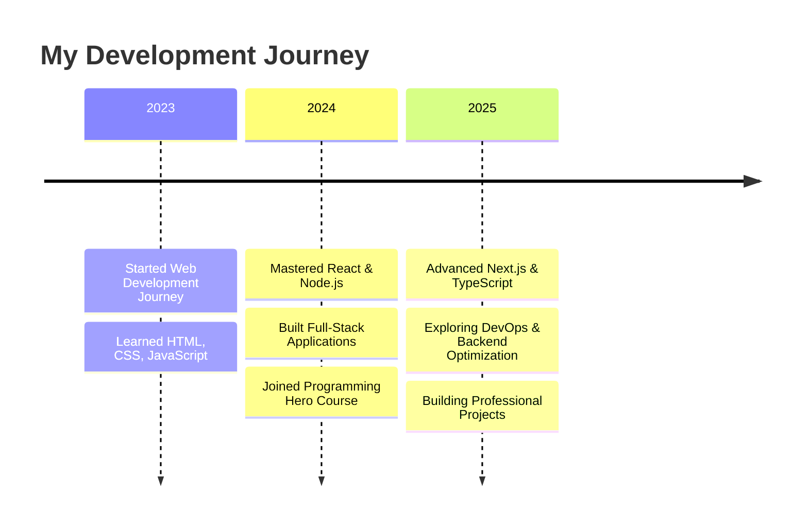

<div align="center">

# 🌟 Ashraful Pathan 🌟
### 💻 MERN Stack Developer | 🚀 React.js & Next.js Specialist | ⚡ Backend Developer


[](https://ashraful.top)
[](mailto:ashrafulpathan3927@gmail.com)
[](https://www.linkedin.com/in/ashrafulpathan)

</div>

---

<div align="center">

</div>

---

## 🚀 About Me


```javascript
const ashraful = {
    name: "Ashraful Pathan",
    location: "Bangladesh 🇧🇩",
    experience: "1+ years",
    passion: ["Coding", "Learning", "Innovation"],
    currentFocus: [
        "Next.js Advanced Features",
        "Backend Optimization", 
        "DevOps Basics"
    ],
    dream: "Building a tech company like Steve Jobs 🍎",
    code: ["JavaScript", "TypeScript", "Python"],
    technologies: {
        frontend: ["React", "Next.js", "HTML5", "CSS3"],
        backend: ["Node.js", "Express.js", "MongoDB"],
        tools: ["Git", "Docker", "Firebase", "Figma"]
    }
};
```

<br clear="right"/>

---

## 🛠️ Tech Stack & Tools

<div align="center">

### 🎨 Frontend Technologies


### ⚡ Backend & Database


### 🔧 Tools & Platforms


### 📦 Additional Skills


</div>

---

## 📊 GitHub Statistics

<div align="center">
  
  
</div>

<div align="center">
  
</div>

<div align="center">
  
</div>

---

## 🎯 Career Journey

<div align="center">



</div>

---

## 🎓 Education & Certifications

<div align="center">

| 🏛️ **Institution** | 📚 **Course/Degree** | 📍 **Location** |
|:-------------------:|:---------------------:|:----------------:|
| Govt. Tolaram College & University | Higher Education | Narayanganj, BD |
| Programming Hero | Complete Web Development | Online |

</div>

---

## 🌍 Languages

<div align="center">

| Language | Proficiency | Progress |
|:--------:|:-----------:|:--------:|
| 🇧🇩 Bengali | Native | ████████████ 100% |
| 🇺🇸 English | Comfortable | ████████░░░░ 80% |
| 🇮🇳 Hindi | Comfortable | ████████░░░░ 80% |
| 🇵🇰 Urdu | Basic | ████░░░░░░░░ 40% |

</div>

---

## 🎯 Current Goals

<div align="center">

```
🔥 Short Term Goals (2025)
├── 🚀 Master Next.js 14+ features
├── 📊 Learn advanced database optimization
├── 🐳 Deep dive into Docker & Kubernetes
└── 🌟 Contribute to open source projects

🌟 Long Term Vision
├── 💼 Build a successful tech company
├── 🌍 Impact millions of users worldwide  
├── 🎓 Become a tech industry leader
└── 🤝 Mentor the next generation of developers
```

</div>

---

## 📈 GitHub Activity

<div align="center">
  
</div>

---

## 🤝 Let's Connect & Collaborate

<div align="center">

### 💬 Find me around the web:

[](https://ashraful.top)
[](https://www.linkedin.com/in/ashrafulpathan)
[](https://www.facebook.com/profile.php?id=100090953234693)
[](https://x.com/AshrafulPa25233)

### 📧 Email me: [ashrafulpathan3927@gmail.com](mailto:ashrafulpathan3927@gmail.com)


</div>

---

<div align="center">

### ⭐ **"Code is like humor. When you have to explain it, it's bad."** ⭐

 <em><b>I love connecting with different people</b> so if you want to say <b>hi, I'll be happy to meet you more!</b> 😊</em>

---

**⭐ From [Ashraful Pathan](https://github.com/ashrafulpathan) - Made with ❤️ and lots of ☕**

</div>
